Working on an event-sourcing based project, we are processing different sources of events with many `KStream`s in the same application. We wanted to put the results of all of them in the same topic, still running a unique application and a single `KafkaStreams`. Of course I forgot about `merge()`, so I was wondering how would we do it.

This lead me to learn more about the Processors and the Optimizations in Kafka Streams which is what I talk about here. I'll sprinkle that with best pratices and things-to-be-aware-of.

A good blog about the optimizations in Kafka Streams is available on Confluent, by its authors: https://www.confluent.io/blog/optimizing-kafka-streams-applications

TOC

# Merge

## Without merge()

How would we do it?

It can't be a simple join. Maybe it could be an outer-join? As soon as one value (left or right) appears, the outer-join is triggered and send either `(A, null)`, `(null, B)` or `(A, B)`. But if there is really a join, or a duplicate, how do I know if I have already sent the left, the right, or none (and avoid duplicates)? I could have some correlation and a state somewhere to identity and remove duplicates.. Wow, it's getting complicated!

Hopefully, `merge()` exists.

## With merge() and bonus

`merge` is a stateless operator. It \_merge_s 2 streams into one, with no particular ordering, it's not deterministic, it's not "one after the other".
There is no synchronization between the 2 streams, one can never emit any event, it won't stop the merge to happen.

_Note: in all the code examples, I simplify and don't display the `serde` parameters, it won't compile._

```kotlin
sb.stream("a")
  .merge(sb.stream("b"))
  .to("c")
```

Already, we can mess-up with Kafka Streams:

```kotlin
// are we getting duplication of "a" in "c" ?
val input = sb.stream("a")
input.merge(input) // we reuse the reference
     .to("c")
```

It doesn't work as expect: no duplication of data (not sure if this is expected (no) or a bug!).

If we check the Topology, we can see our merge has only one source instead of 2 (it's a merge!):

```
Topologies:
   Sub-topology: 0
    Source: KSTREAM-SOURCE-0000000000 (topics: [a])
      --> KSTREAM-MERGE-0000000001

    Processor: KSTREAM-MERGE-0000000001 (stores: [])
      --> KSTREAM-SINK-0000000002
      <-- KSTREAM-SOURCE-0000000000

    Sink: KSTREAM-SINK-0000000002 (topic: c)
      <-- KSTREAM-MERGE-0000000001
```

Compared to a real merge with 2 sources (2 different topics):

```
Topologies:
   Sub-topology: 0
    Source: KSTREAM-SOURCE-0000000000 (topics: [a])
      --> KSTREAM-MERGE-0000000002

    Source: KSTREAM-SOURCE-0000000001 (topics: [b])
      --> KSTREAM-MERGE-0000000002

    Processor: KSTREAM-MERGE-0000000002 (stores: [])
      --> KSTREAM-SINK-0000000003
      <-- KSTREAM-SOURCE-0000000000, KSTREAM-SOURCE-0000000001

    Sink: KSTREAM-SINK-0000000003 (topic: c)
      <-- KSTREAM-MERGE-0000000002
```

[[float]]
|
|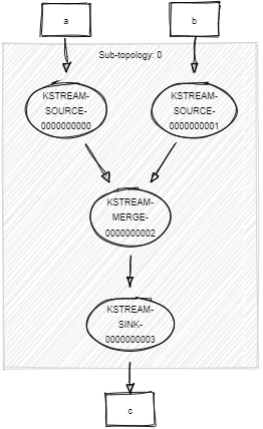

# Good practices

Before going back Kafka Streams merge(), Topology and optimizations, let's take a detour about FP principles.

## Beware of the Referential Transparency

Be aware that Kafka Streams is:

- **not immutable-friendly**: it alters the structures behind the scene.
- **not referentially-transparent**: we can't just replace a variable by its value, the behavior will change.

This can lead to some surprises, a different behavior after refactoring, or runtime exceptions.

Consider our previous example, and inline the variable `input`:

```kotlin
val input = sb.stream("a")
input.merge(input).to("c")

// replace `input` by its value, a simple refactoring (think bigger for real use-cases):
sb.stream("a").merge(sb.stream("a")).to("c")
```

This will crash at runtime:

```
TopologyException: Invalid topology: Topic prices has already been registered by another source.
```

This is not the only place where referential-transparency doesn't work.
It's the same with all the `*Supplier` variants that must return a unique instance.
We can't refactor without thinking about what we are doing, because we may alter the behavior of our program.

Doing so:

```java
DeduplicationTransformer<> transformer = new DeduplicationTransformer(...);
stream.transform(() -> transformer, ...)
```

We get this error at runtime (!):

```
Failed to process stream task 0_0 due to the following error:
java.lang.IllegalStateException: This should not happen as timestamp()
should only be called while a record is processed
```

Whereas with the inline version, it works:

```java
stream.transform(() -> new DeduplicationTransformer<>(...), ...)
```

About **immutability**, each call to `.filter`, `.map` etc. mutates the `Topology` behind. We are getting a new reference to a `KStream`, but all the `KStream`s share the same `Topology` behind. We can't neither use the same `StreamsBuilder` to build different topologies, because it also references the same `Topology`.

## Naming the processors

When we work with Kafka Streams, we are getting used to capital names "KSTREAM-SOURCE-000000042", "KSTREAM-MERGE-00000001337" but we can make it easier for us.

When we look at a Topology, instead of having unhelpful source, processor, and sink names, it's better to name them.
It's the concept of the `Consumed`, `Produced`, `Grouped`, `Joined`, `Printed`, `Suppressed` instances: to name and configure the operators hidden behind the DSL.

```
Topologies:
   Sub-topology: 0
    Source: KSTREAM-SOURCE-0000000000 (topics: [a])
      --> KSTREAM-MERGE-0000000002
    Source: KSTREAM-SOURCE-0000000001 (topics: [b])
      --> KSTREAM-MERGE-0000000002
    Processor: KSTREAM-MERGE-0000000002 (stores: [])
      --> KSTREAM-SINK-0000000003
      <-- KSTREAM-SOURCE-0000000000, KSTREAM-SOURCE-0000000001
    Sink: KSTREAM-SINK-0000000003 (topic: c)
      <-- KSTREAM-MERGE-0000000002
```

To

```
Topologies:
   Sub-topology: 0
    Source: sensor-a (topics: [a])
      --> merging-sensors
    Source: sensor-b (topics: [b])
      --> merging-sensors
    Processor: merging-sensors (stores: [])
      --> to-the-world
      <-- sensor-a, sensor-b
    Sink: to-the-world (topic: c)
      <-- merging-sensors
```

[[float]]
|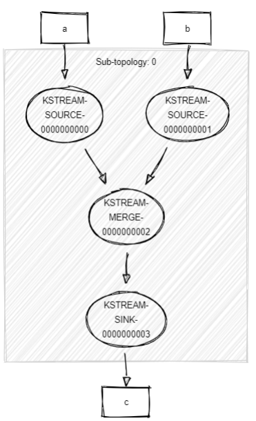
|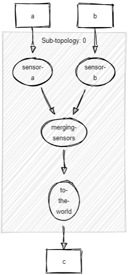

For `merge`, `map*`, `*transform*`, `join*` etc., in 2.3 it's not _yet_ possible to assign a custom name to the processors. The work has been done, but not yet released. A new `Named` parameters will show up to customize them. See [KIP-307](https://cwiki.apache.org/confluence/display/KAFKA/KIP-307%3A+Allow+to+define+custom+processor+names+with+KStreams+DSL).

# The Processor API

## Link between KafkaStreams, StreamsBuilder, Topology

Before diving into the Processor API, let's talk about the low-level DSL versus high-level DSL.

Here is an simple object diagram of the link between our friends:

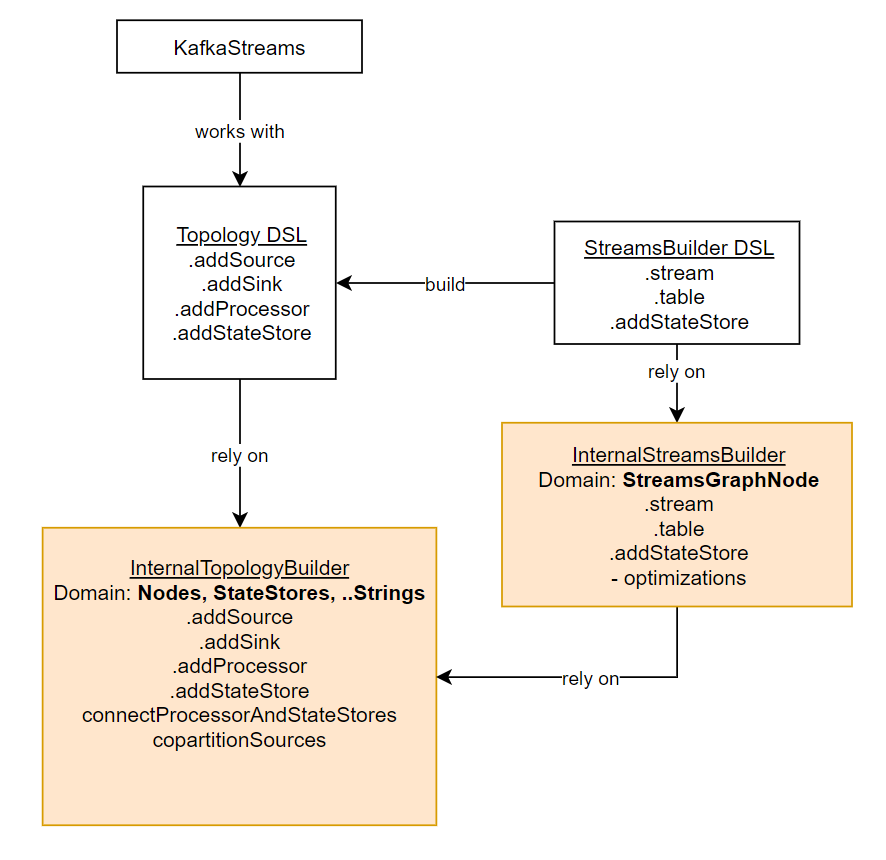

- Kafka Streams runs a `Topology`.

* When we don't use the high-level DSL, we directly build a `Topology` (_the physical plan_, that's exactly what Kafka Streams will run) that forwards calls to a `InternalTopologyBuilder`: this is the latter that contains all the data about the real topology underneath.

- When we use the high-level DSL, we pass through the `StreamsBuilder` (_the Logical Plan_, that's going to be converted to a physical plan) that forwards calls to a `InternalStreamsBuilder`. When we ask to `build()` the StreamsBuilder, it converts its abstraction to a `Topology`.

* A `Topology` talks about _Nodes_, _Processors_, _StateStores_ and Strings (to link Nodes children/parent by name).
* A `Streams` is more abstract and talks about _StreamsGraphNodes_. One `StreamsGraphNode` can generate multiple Nodes and StateStores.

This abstraction allows Kafka Streams (the StreamsBuilder) to optimize what it's going to generate as Topology. The `StreamsGraphNode`s expose a lot of metadata for the optimizer to be able to optimize (move, merge, delete, replace) locally or globally the `StreamsGraphNode`s (without altering the behavior), before converting it to a Topology (which is dumb).

## A manual merge()

Back to our merge, we can do something simple using the Processor API:

```kotlin
val t = Topology()
t.addSource(            // i'm using all the options, for the sake of it
    Topology.AutoOffsetReset.EARLIEST,
    "sensor-a", // its name
    WallclockTimestampExtractor(),
    Serdes.String().deserializer(),            // only the deser, no Serde here
    Serdes.String().deserializer(),            // only the deser, no Serde here
    "topic-a"
)
t.addSource(
    Topology.AutoOffsetReset.EARLIEST,
    "sensor-b", // its name
    WallclockTimestampExtractor(),
    Serdes.String().deserializer(),            // only the deser, no Serde here
    Serdes.String().deserializer(),            // only the deser, no Serde here
    "topic-b"
)
t.addSink(
    "to-the-world", // its name
    "output-topic",
    Serdes.String().serializer(),              // only the ser, no Serde here
    Serdes.String().serializer(),              // only the ser, no Serde here
    StreamPartitioner { topic, k: String, v: String, par -> Random.nextInt() % par },
    "sensor-a", "sensor-b" // its parent
)
```

```
Topologies:
   Sub-topology: 0
    Source: sensor-a (topics: [topic-a])
      --> to-the-world
    Source: sensor-b (topics: [topic-b])
      --> to-the-world
    Sink: to-the-world (topic: output-topic)
      <-- sensor-a, sensor-b
```

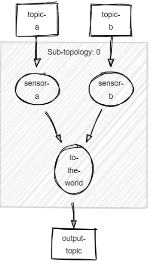

If we look carefully, we'll notice we don't even have a `Processor` in there! (nit: actually the Source and Sink are ProcessorNodes) We had one when we were using the high-level DSL "KSTREAM-MERGE" (it was just a passthrough). Thanks to the Processor API, we can plug directly multiples Sources to a Sink.

This is probably something that can be automatically optimized away when optimizations are on (it does not do it right now).

This lead to the question: which optimizations are possible, are going to be possible, and how Kafka Streams does them?

# StreamThreads & Backpressure

Do you know you can run Kafka Streams without Sink?

Unlike many streaming systems, Kafka Streams does not need to handle backpressure while processing. The only existing backpressure is outside of the Topology: it's the `StreamThread`s that each manage a `KafkaConsumer`. This one has subscribed to the source topics (it has access to the Topology) and is often `poll()` to get the data.

The records are bufferized and sent downstream (to the `StreamTask`s), one by one for processing: Kafka Streams has a depth-first approach. It's a _push-based_ approach. The entire graph is traversed before another record is forwarded through the topology. There are no buffers between operators.

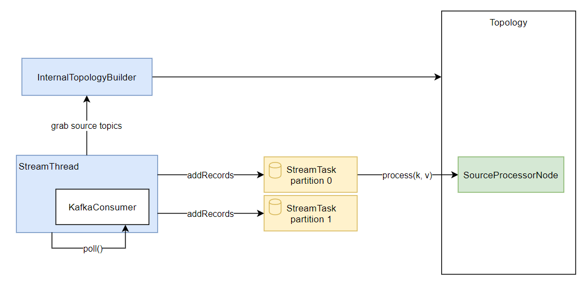

Kafka Streams tries to fill its in-memory buffers from the `poll()` data (without committing offsets of course, until processing). If a partition buffer is full (slow processing) or if some topics are consumed way faster than other, then Kafka Streams will `pause()` (KafkaConsumer API) some partitions, to keep everyone on the same page (same time). This is the only place where there is some backpressure. If some error occurs in the stream processing, because the data are backed by Kafka, Kafka Streams will resume to the latest committed offset of the source topics.

A Breadth-First approach will probably be worked on later in Kafka Streams, to allow for parallel processing. For instance, if doing IOs in a Streams, it's better to parallelize processing. It's naturally done at the partition level right now thanks to the Kafka partitionning model, but it could be finer. Check out [KAFKA-6034](https://issues.apache.org/jira/browse/KAFKA-6034).

In reactive streams programming, operators tell their need/capability to their parents, to ensure they won't overflow, and the ask (consolidated by all other operators across) goes upstream until it reaches the sources. There, data are pushed or pulled upon demand when downstream is ready to accept more. The strategy of pull/push can vary over time ("I know you will ask me for more data soon, so I will directly push data to you from now on. But if you struggle with, I'll stop pushing and you'll go back to pull me data."), but that's another story.


All that to say that's why we can have working topologies without sinks in Kafka Streams: data are pushed, and nobody is asking for more.

```kotlin
sb.stream("a").print(Printed.toSysOut())
```

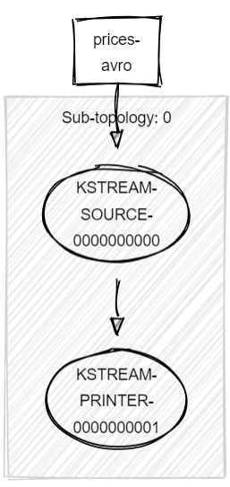

Note that offsets will be properly committed to Kafka. So when we say Kafka Streams is _only_ for process "reading from topics and writing to topics", it's not entirely true. We can query webservices, save data into databases etc. without ever having to sink into a topic.

It's not the right use-case. Doing so won't ensure exactly-once processing with the external systems (ensure there are idempotent!) because they are outside of Kafka scope, and we won't have a trace of our processing. This is why [Kafka Connect](https://docs.confluent.io/current/connect/index.html) exist.

# From Logical Plan To Optimized Logical Plan

Using the Processor API, we optimized right away our topology. But we're humans, we can miss optimizations or do worse.

## How to enjoy optimizations?

Kafka Streams won't optimize our Topology if we go straight to the low-level API. Optimizations are only enabled when writing with the high-level DSL.

Optimization must be declared when we `build()` the Topology, not in the general `KafkaStreams` config, otherwise that won't do a thing.

```kotlin
val sb = StreamsBuilder()
// ...
val topo = sb.build(Properties().apply {
    put(StreamsConfig.TOPOLOGY_OPTIMIZATION, StreamsConfig.OPTIMIZE)
})
```

Every call to the high-level DSLs creates a `StreamsGraphNode` and add different metadata, according to the function called, to the state of the parents etc.

For instance, when we do a `merge()`, this adds a `StreamsGraphNode` whose parents are the 2 original incoming KStreams `StreamsGraphNode`s. It also flags this new node as a _mergeNode_ and as _repartitionRequired_ if one of the original incoming KStreams already required repartitioning. When we're going to build the Topology, this node is going to be converted to a simple Processor with 2 parents, letting data pass through it, to its child.

But before that, Kafka Streams will try to optimize it and more globally, its Logical Plan. To do this, it relies on the medata we're talking about.

## StreamsBuilder to Topology

When we `.build()` our `StreamsBuilder`, the first thing it does is check if the optimization are opt-in. If that's the case, it optimizes the graph of `StreamsGraphNode` to a new graph of `StreamsGraphNode` (actually, it mutates it). Then it can build the low level `Topology`. To do so, it iterates over all the ordered nodes and ask them to `writeToTopology`.

Right now, there are 2 kinds of optimizations:

- KTable Source Topics: don't always build a `-changelog` topic if it can reuse the source topic, to avoid duplicating the source topic.

- Repartition Operations: this is the meat. This will try to prevent repartition multiple times the same topic.

## 1. Source Topics as Changelog

A `KTable` is not always backed by a `-changelog` topic. Example:

```kotlin
sb.table("a")
  .toStream()
  .to("b")
```

In this case, it will forward all non-null-keys records downstream (a KTable ignores null keys), and no statestore will be created:


Another example:

```kotlin
sb.stream("a")
  .join(sb.table("b")) { a, b -> b }
  .to("c")
```

Without optimization, this will generate a `-changelog` topic to keep the state (latest value by key) of `b`, whereas with optimization, no `-changelog` will be created.

The optimizer makes KTables reuse source topics if they can, instead of always building their own changelog topic. Still, we have to ensure the source topic has a compact strategy (it’s the default for the `-changelog` topics) otherwise the restauration into the local state (RocksDB) can take a while (if we have 10M records, but only with 100 distinct keys: it’s going to consume 10M records instead of 100).

Without optimizations enabled, it’s still possible to avoid generating a `-changelog` topic when creating a KTable:

```kotlin
sb.table("topic", Materialized.with(Serdes.String(), Serdes.String())
                              .withLoggingDisabled())
```

## 2. Key Changing & Repartition Required Operations

When we use `selectKey`, `map`, `flatMap`, `transform`, `flatTransform` or `groupBy(KeyValueMapper)` (does a `selectKey`), the resulting `KStream` is always flagged as `repartitionRequired`, and the underneath `StreamsGraphNode` is marked as `keyChanging` (`KStream` is an abstraction over the Logical Plan, the `StreamsGraphNode`s).

`repartitionRequired` on the `KStream` is used to _mark_ the downstream KStreams that they belong to a graph where repartition is required by some parent. `keyChanging` will be used by the optimizer (it works with `StreamsGraphNode`s, not with `KStream` which is only a DSL-abstraction for humans).

`through()` and all kinds of `*join()` (if `repartitionRequired`) will stop the propagation of `repartitionRequired`, because they will sink the data into a topic. Hence, no repartition is needed after them: it has been materialized and this will form a new sub-topology.

For example, when joining:

- KStream + KStream: this will create a `-left-repartition` and/or `-right-repartition` topics if the upstream KStreams are flagged as `repartitionRequired` (we should use a `Joined` to get a nice name). These topics will be the real sources of data for the join.

```kotlin
// this will create "applicationId-keeping-only-b-left-repartition" topic
sb.stream("a")
  .map { k, v -> KeyValue.pair(k, v) }
  .leftJoin(sb.stream("b"), { a, b -> b }, JoinWindows.of(1000), Joined.`as`("keeping-only-b"))
  .to("c")
```

- KStream + KTable: this will create a `-repartition` topic if the KStream is flagged as `repartitionRequired`. This topic will be the real source for the join.

# The Optim1zer

Let's dive a bit more into the repartition optimization, which is the biggest piece.

## The OptimizableRepartitionNode

The optimizer works by finding and creating/replacing `OptimizableRepartitionNode`s.

Such nodes are created when the current `KStream` is flagged `repartitionRequired` by the upstream and when we do:

- an aggregation: `reduce(..)`, `aggregate(..)`, `count()` (after `groupBy*(..)` or `windowedBy(..)`)
- a `*join()` with KStream/KTable

When built, a `OptimizableRepartitionNode` adds multiple things to the `Topology`:

- an internal repartition topic `t`
- a Processor `P` to filter `null` keys (not forwarded downstream)
- a Sink to the repartition topic `t` with `P` as parent
- a Source from the repartition topic `t`

In short, it hides the repartition logic. Below in red, the four elements:


Each `OptimizableRepartitionNode` creates a new sub-topology, because we pass through a new topic.

## Visualizing the Logical Plan: before and after

Now that we know what is a `OptimizableRepartitionNode`, let's visualize them.
Those structures are private in the code, it's different than what we get when we `.describe()` a `Topology`, which is the physical plan. Here, we're talking about the Logical Plan.

Let's make Kafka Streams optimize our Logical Plan, by doing a `map()` (keyChanging operation) and a `join()`:

```kotlin
sb.stream("a")
  .map { k, v -> KeyValue.pair(k, v) }
  .join(sb.table("b")) { a, b -> b }
  .to("c")
```

As we said, we can see an `OptimizableRepartitionNode`. But unfortunately, that's not enough any optimization to kick-in. The high-level graph topology is this:

```
root ()
    KSTREAM-SOURCE-0000000000 (StreamSourceNode)
        KSTREAM-MAP-0000000001 (ProcessorGraphNode)
            KSTREAM-SOURCE-0000000007 (OptimizableRepartitionNode)
                KSTREAM-JOIN-0000000008 (StreamTableJoinNode)
                    KSTREAM-SINK-0000000009 (StreamSinkNode)
    KTABLE-SOURCE-0000000004 (TableSourceNode)
```

After "optimization", the `OptimizableRepartitionNode` will be replaced by another `OptimizableRepartitionNode` and that's it. No changes. No gain. It's an edge case that probably could be optimized (useless). Let's go deeper.

## Our First (De-)Optimization

What if we add a `filter()` after our `map()`?

```kotlin
sb.stream("a")
  .map { k, v -> KeyValue.pair(k, v) }
  .filter { k, v -> false } // don't let pass anything!
  .join(sb.table("b")) { x, y -> y }
  .to("c")
```

An "optimization" will kick in:

- Before:

```
KSTREAM-SOURCE-0000000000 (StreamSourceNode)
    KSTREAM-MAP-0000000001 (ProcessorGraphNode)
        KSTREAM-FILTER-0000000002 (ProcessorGraphNode)
            KSTREAM-SOURCE-0000000008 (OptimizableRepartitionNode)
                KSTREAM-JOIN-0000000009 (StreamTableJoinNode)
                    KSTREAM-SINK-0000000010 (StreamSinkNode)
KTABLE-SOURCE-0000000005 (TableSourceNode)
```

- After:

```
KSTREAM-SOURCE-0000000000 (StreamSourceNode)
    KSTREAM-MAP-0000000001 (ProcessorGraphNode)
        KSTREAM-SOURCE-0000000013 (OptimizableRepartitionNode)
            KSTREAM-FILTER-0000000002 (ProcessorGraphNode)
                KSTREAM-JOIN-0000000009 (StreamTableJoinNode)
                    KSTREAM-SINK-0000000010 (StreamSinkNode)
KTABLE-SOURCE-0000000005 (TableSourceNode)
```

Did you see what changed? The FILTER is not at the same place, and the `OptimizableRepartitionNode` is a new Node (id changed).

Post-optimization, the FILTER is the child of the `OptimizableRepartitionNode` instead of being its parent. It means the `OptimizableRepartitionNode` is written in the Topology _before_ our filter. (nit: each node has actually a priority to determine the order of writing)

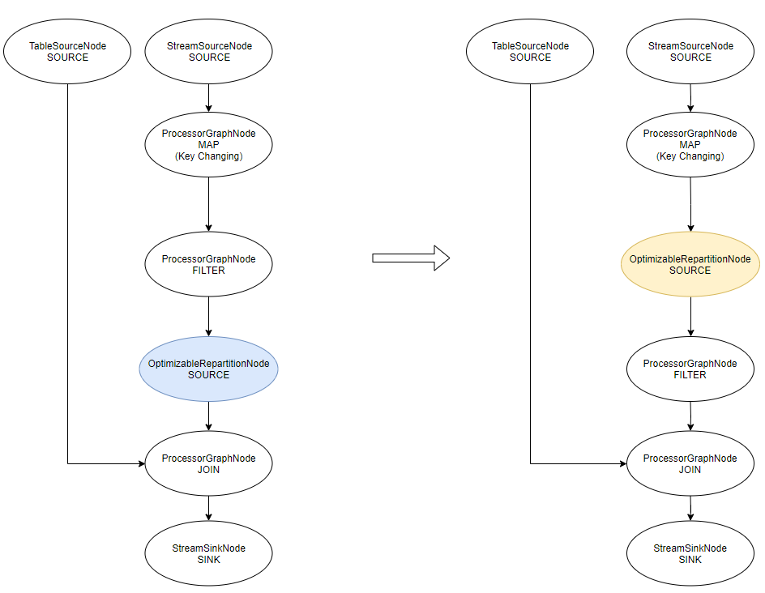

Looking at the `Topology` makes more sense:

[[float]]
|
|

In the second version, "optimized", the filter is executed _after_ the repartition logic.

Unfortunately, this means the repartition topic will contain **MORE** data than with the unoptimized version. Not good. Especially in my extreme case here, where my filter was a plain "don't let pass anything (`.filter { k, v -> false }`)", my repartition topic will actually contain everything instead of nothing.

> We should always analyze our topology no matter if we use optimizations or not.

What's the point of this optimization therefore? What I described here is not an optimization.
But if we look at the global picture, it's more nuanced.

## Source Topics as Changelogs revisited

I've started the same streams with and without optimization. Right after the start of the streams, if we look in [Conduktor](https://www.conduktor.io/), we get this:


We wait a bit then refresh:


A few points here:

- `c` topic is empty because we filter out all records (`.filter { k, v -> false }`).

* In the _unoptimized_ version
  - we have 2 internal topics
  - The repartition topic is always empty (thanks to our `filter()`).
  - The changelog topic contains 200 records, which is the number of distinct keys of `a`

- In the _optimized_ version
  - we have only 1 internal topic: the KTable can reuse its source topic `b` if it needs to rebuild its local state
    - This means it needs to consume 5,209 records to find out there are only 200 distinct keys
  - The repartition topic contains everything unfiltered at first (5,209), then is purged by Kafka Streams (because it knows it's temporary data, it deletes them after committing; see [KAFKA-6150 - Make Repartition Topics Transient](https://issues.apache.org/jira/browse/KAFKA-6150)).

So, all in all, it's not so bad. With optimizations, we avoid the creation of a topic, and the repartition-topic, albeit unfiltered, is quickly purged. Still, a `filter()` should always be executed before a `map()`. Let's talk about Operator Selectivity & Reordering.

## Operator Selectivity & Reordering

Operators have a _selectivity_.

- `map*` have a selectivity of 1: 1 item in, 1 item out.
- `filter*` have a selectivity between `0 ≤ s ≤ 1`, it depends upon the filter.
- `flatMap*` and `*transform*` have an unknown selectivity. They can emit 0 or many items for one item in. But according to our use-case, we can know if it's fixed or dynamic.

All that to say that when we do a `map(..).filter(..)`, what we want is generally `filter(..).map(..)` because we'll do less `map`ping with the second version, the selectivity of `filter` being generally less than 1: less records out.

It's a possible optimization Kafka Streams can apply, known as _Operator Reordering_, but it's not so straightforward.

- If `map(..)` and `filter(..)` works on the same type `A`, then it's possible to invert them.
- If `map(..)` takes a `A` and returns a `B` then the code in `filter(..)` (was working on `B`) needs to be updated to work on `A`. We could call the same `map(..)` to convert `B` to `A` and let `filter(..)` untouched, but that would defeat the purpose of the optimization.

Another dimension is the _cost_ of the operators. If we know one operator has a large cost (like doing IO or massive computations) then it's better to defer it the most we can, after other operator with a selectivity < 1 went through.

## The Real Optimization

To see a clear value added to the repartition optimization, we need to complexify our topology to create 2 `OptimizableRepartitionNode`s that derive from the same `repartitionRequired` KStream:

```kotlin
// We build a `repartitionRequired` KStream
// -> map, selectKey, flatMap, transform, or flatTransform

val k = sb.stream("a").map { k, v -> KeyValue.pair(k, v) }

// Then we create 2 sub-graphs from this KStream

k.join(sb.table("b"), { x, y -> y }) // First OptimizableRepartitionNode
 .to("c")

k.groupByKey()
 .count()                            // Second OptimizableRepartitionNode
 .toStream()
 .to("d")
```

The unoptimized Logical Plan looks like:

```
root
    KSTREAM-SOURCE-0000000000 (StreamSourceNode)
        KSTREAM-MAP-0000000001 (ProcessorGraphNode)
          -> KSTREAM-SOURCE-0000000007 (OptimizableRepartitionNode)
                KSTREAM-JOIN-0000000008 (StreamTableJoinNode)
                    KSTREAM-SINK-0000000009 (StreamSinkNode)
          -> KSTREAM-SOURCE-0000000014 (OptimizableRepartitionNode)
                KSTREAM-AGGREGATE-0000000011 (StatefulProcessorNode)
                    KTABLE-TOSTREAM-0000000015 (ProcessorGraphNode)
                        KSTREAM-KEY-SELECT-0000000016 (ProcessorGraphNode)
                            KSTREAM-SINK-0000000017 (StreamSinkNode)
    KTABLE-SOURCE-0000000004 (TableSourceNode)
```

The optimized Logical Plan looks like:

```
root
    KSTREAM-SOURCE-0000000000 (StreamSourceNode)
        KSTREAM-MAP-0000000001 (ProcessorGraphNode)
          -> KSTREAM-SOURCE-0000000020 (OptimizableRepartitionNode)
                KSTREAM-JOIN-0000000008 (StreamTableJoinNode)
                    KSTREAM-SINK-0000000009 (StreamSinkNode)
                KSTREAM-AGGREGATE-0000000011 (StatefulProcessorNode)
                    KTABLE-TOSTREAM-0000000015 (ProcessorGraphNode)
                        KSTREAM-KEY-SELECT-0000000016 (ProcessorGraphNode)
                            KSTREAM-SINK-0000000017 (StreamSinkNode)
    KTABLE-SOURCE-0000000004 (TableSourceNode)
```

A picture is worth a thousand words (we won't show the Physical Plan, no need):


If we look at our topics in [Conduktor](https://www.conduktor.io/), we are happy to have optimized our topology:


- The unoptimized version has 2 repartition topics and 2 changelog topics (ktable and aggregate).
- The optimized version has 1 repartition topic and 1 changelog topic (the aggregate).

The 2 `OptimizableRepartitionNode` were "merged" and the new node replugged itself to the parent and the children of the old nodes. This is what the optimizer does. It prevents the topology to generate several repartition topic that will contain the same data.

Instead of having 3 sub-topologies, we only have 2 (one less repartition topic). Imagine on a real Kafka Streams application with multiple aggregations, computing different aggregations on the same KStream, doing several joins, the gain can be tremendous (less topics: less storage, mem, and IO) .

Reminder: we need a key-changing operation for the optimizations to occur. If we never `selectKey`, `map`, `flatMap`, `transform`, `flatTransform` or `groupBy`, no KStream will be marked as `repartitionRequired`, hence no `OptimizableRepartitionNode` will be created.

## Value Change after a Key Change

There will **prevent** any optimizations:

```kotlin
val t = sb.stream("a")
          .selectKey { k, v -> k }
          .mapValues { k, v -> v }
// ... same as before
```

By adding a `.mapValues` (a _value-changing_ operation) after the a key-changing operation, the optimization won't apply.
I'm not entirely sure why. At first, this looks dumb anyway. If I do a key-changing followed by a value-changing operation, it means I need a `map()` or equivalent to do both at the same time. But in the grand scheme of things, where functions are everywhere, returning `KStream`s, this situation may happen (and could lead to an _operator fusion_ optimization!).

Operations `*mapValues()` and `*transformValues()` are _value-changing_ operations. We can just change the value of the record, this will prevent any repartitioning (because the key stays as-is). It's a best practice to use them whenever possible.

## Back to our merge()

Finally we're back to our merge!

Let's see how the optimizations work around a merge by looking at the Logical Plan before & after (the Physical Plan would be to painful to look at). (btw notice the end of this article: Limitations & Issues about `merge()`)

```kotlin
val s1 = sb.stream("a")
val s2 = sb.stream("b").map{ k, v -> KeyValue.pair (k, v) }
val s3 = s1.merge(s2) // s3 becomes repartitionRequired because of s2

// both streams will their repartition logic
s3.join(sb.table("c"), { x, y -> y }).to("d")
s3.groupByKey().count().mapValues { k, v -> v.toString() }.toStream().to("e")
```

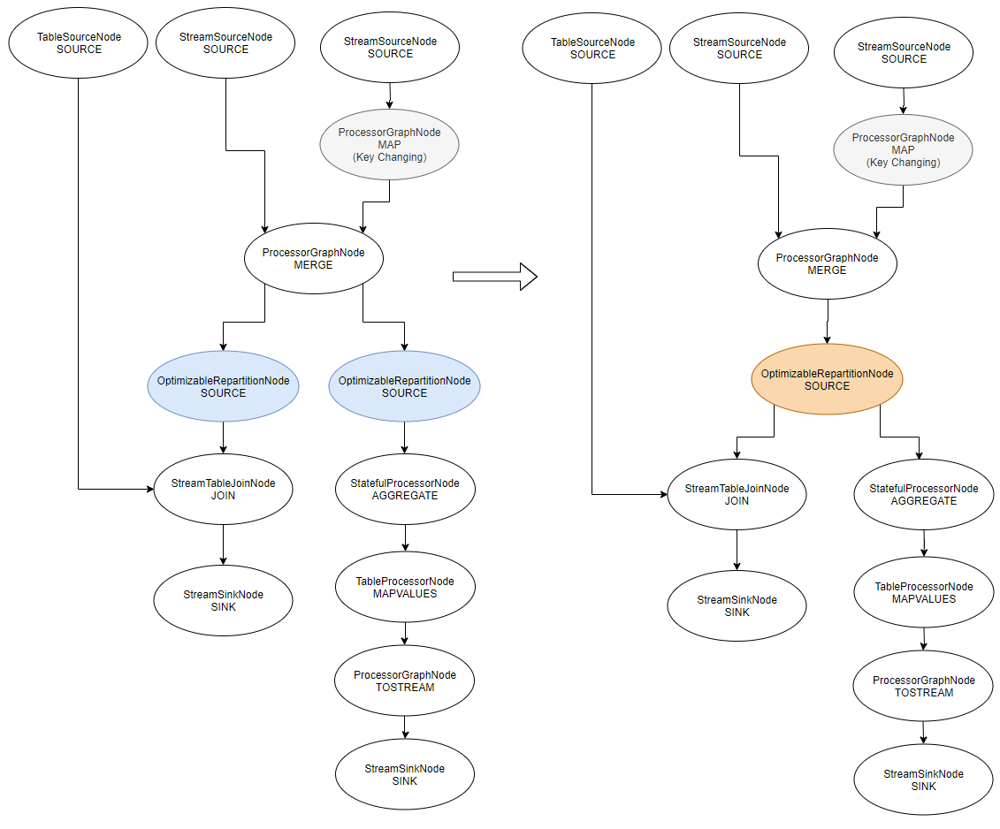

Because our `merge` depends upon one `repartitionRequired` KStream (because of the `map()`), the whole `merge` is now `repartitionRequired` and will propagate downstream. This will create the two `OptimizableRepartitionNode`s we see (`join()` and `count()`).

Because the two repartition topics will contain exactly the same data (the source being the same), the optimizer will replace both by a unique one, and replug the graph around it.

The optimizer handles `merge()` in a specific way. If it wasn't the case, the new `OptimizableRepartitionNode` would place itself after the MAP and before the MERGE, and that would totally mess up the Topology and results (I think).

# Future Optimizations

Guozhang Wang added a lot of possible optimizations in [KAFKA-6034 - Streams DSL to Processor Topology Translation Improvements](https://issues.apache.org/jira/browse/KAFKA-6034) mostly based upon [Stream Processing Optimizations](http://hirzels.com/martin/papers/debs13-tutorial.pdf).

Below is a recap of what we can expect Kafka Streams will optimize in the future. But we shouldn't wait for the implementations to be in Kafka Streams. According to our use-cases, we can already apply them manually. It's just a bunch of generic or Kafka Streams specific patterns.

## Operator Separation and Fission

To allow a better leveraging parallel processing power: split `stream.map(f∘g)` to `stream.map(f).map(g)`, then we can support different needs of parallelism for `f` and `g`.

Start by splitting the operation:


Then apply a fission for `f` and/or `g`


This is what is done at the partition level in Kafka Streams thanks to Kafka, but it can be finer than that and work with multiple threads or fibers at the same time per partition.

## Operator Fusion / Scheduling / Batching

Kafka Streams is using only the _Depth-First_ strategy for now (one record traverse the whole topology at a time), but it could introduce the _Breath-First_ strategy (which introduces some synchronization points):

- Send a batch of records to the first operator, then wait to collect
- Send its results to the second operator
- Meanwhile, send another batch of data to the first operator while the second is working on its own batch.

For IO heavy operations, it could break the operation into its own sub-topology with threads that can suspend / resume the IOs, as in the Fission optimization.

It's a way to deal with async calls in a topology. For example, using Akka Streams:

```scala
Source(1 to 1000)
  .mapAsync(20)(fetchFromDatabase)
  .runWith(Sink.ignore)
```

`mapAsync` takes a degree of acceptable parallelism and a function returning a `Future`. At any point in time, there are max 20 in-flight remote calls. The output order follows the input order (there is another operator `mapAsyncUnordered`, faster because it ignores ordering).

I'm not sure what it's going to be in Kafka Streams, but I would love to see a `mapAsync`.

## Redundancy Elimination

If the same operator doing the same thing appears several times, try to factorize it and _broadcast_ the values downstream.


This is typically what is done with the key-changing operations that are reused:

The following is not optimized (`map(f)` generates two distinct operators doing the same thing):

```kotlin
val t = sb.stream("a")
val f = { key: String, value: String -> KeyValue.pair(key, value) }
t.map(f).filter { k, v -> false }.to("b")
t.map(f).filter { k, v -> true }.to("c")
```


## Multi-Join Operator Reordering

Re-order the join ordering based on join selectivity and cost, like the Operator Reordering optimization.

## State Sharing / Join operator sharing

Share results of all `s1.join(s2)` in the code, like `s1.join(s2).join(stream3)` could reuse it.


## Cogroup aggregations

[KIP-150 - Cogroup](https://cwiki.apache.org/confluence/display/KAFKA/KIP-150+-+Kafka-Streams+Cogroup): cogroup multiple aggregates

- into a new entity `CogroupedKStream` to reduce creation of unnecessary objects. (unfortunately in stand-by it seems)

## Disable logging and reuse sink topic when changelog = sink topic

As raised in [KAFKA-6035](https://issues.apache.org/jira/browse/KAFKA-6035), when we build an aggregate and sink it directly, we're going to create a `-changelog` topic that will contain exactly the data of the output topic:

```kotlin
sb.stream("a")
  .groupByKey()
  .aggregate({ ... }, { k, v, agg -> ... }, Materialized.`as`("hop").withCachingDisabled())
  .toStream()
  .to("b");
```

No matter if we enable optimizations or not, we'll find the same content in the `-changelog` topic and the `out` topic:


It would be useful to disable logging on this one and rely on the output topic to rebuild the state of the aggregation, to avoid creating redundant `-changelog` topics:

```kotlin
.aggregate({ ... }, { k, v, agg -> ... }, Materialized.`as`("hop").withLoggingDisabled())
```

# Limitations & Issues

## Key Changing reference out of scope

I ran into a couple of issues enabling optimizations that prevented Kafka Streams from working. In this case, we must disable optimizations and optimize ourself. (and notify the Kafka Streams team)

For instance, if we take this `branch` example that aggregates each split (notice the `map()` to repartition data):

```kotlin
val f = { key: String, value: String -> KeyValue.pair(key, value) }
val p = Predicate<String, String> { k, _ -> k.length <= 7 }

val t = sb.stream("a").map(f).branch(p, p.not())
t[0].groupByKey().aggregate(...).toStream().to("b")
t[1].groupByKey().aggregate(...).toStream().to("c")
```

The high-level graph is:

```
root
    KSTREAM-SOURCE-0000000000 (StreamSourceNode)
        KSTREAM-MAP-0000000001 (ProcessorGraphNode)
            KSTREAM-BRANCH-0000000002 (ProcessorGraphNode)

                KSTREAM-BRANCHCHILD-0000000003 (ProcessorGraphNode)
                    KSTREAM-SOURCE-0000000008 (OptimizableRepartitionNode)
                        KSTREAM-AGGREGATE-0000000005 (StatefulProcessorNode)
                            KTABLE-TOSTREAM-0000000009 (ProcessorGraphNode)
                                KSTREAM-SINK-0000000010 (StreamSinkNode)

                KSTREAM-BRANCHCHILD-0000000004 (ProcessorGraphNode)
                    KSTREAM-SOURCE-0000000014 (OptimizableRepartitionNode)
                        KSTREAM-AGGREGATE-0000000011 (StatefulProcessorNode)
                            KTABLE-TOSTREAM-0000000015 (ProcessorGraphNode)
                                KSTREAM-SINK-0000000016 (StreamSinkNode)
```

The generated Topology is: (`OptimizableRepartitionNodes` highlighted in red)

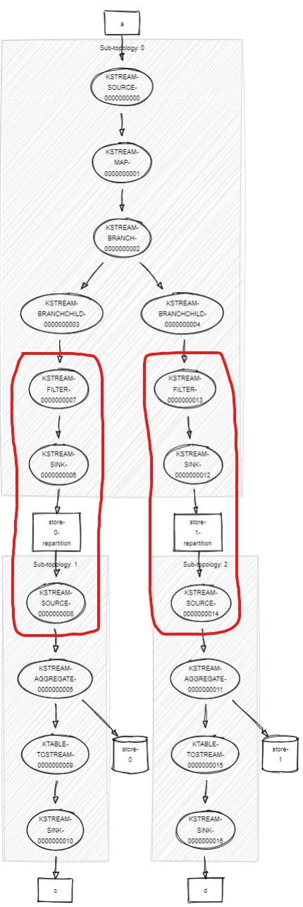

If we use `StreamsConfig.OPTIMIZE`, boom:

```wrap
StreamsException: Found a null keyChangingChild node for OptimizableRepartitionNode
- StreamsGraphNode{nodeName='KSTREAM-SOURCE-0000000014', ...}
- BaseRepartitionNode {
... sinkName='KSTREAM-SINK-0000000012'
... sourceName='KSTREAM-SOURCE-0000000014'
... repartitionTopic='store-1-repartition'
... processor name='KSTREAM-FILTER-0000000013'
```

What happens is this:

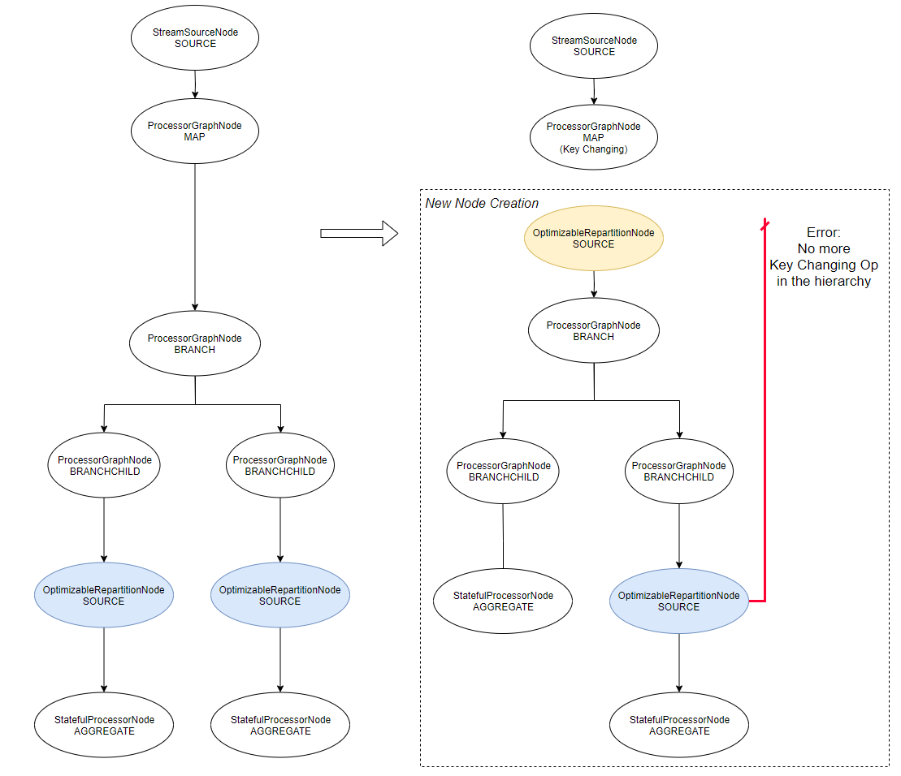

- Both `OptimizableRepartitionNode` are flagged for optimization
- The first optimization occurs on the first branch, it builds a new `OptimizableRepartitionNode`, unplug the children of the key-changing operation (`map()`) because it's going to be the new child.
- But before this, it tries to optimize the second branch and can't find the key-changing operation (the `map()`) because the new node is not plugged yet into the topology.

We can get the same error without `branch`, like in one of our previous example:

```kotlin
val k = sb.stream("a").map { k, v -> KeyValue.pair(k, v) }
          .filter { k, v -> true } // BOOM! StreamsException: Found a null keyChangingChild
k.join(sb.table("b"), { x, y -> y }).to("c")
k.groupByKey().count().toStream().to("d")
```

According to what we put between the keyChanging node and the `OptimizableRepartitionNode` children, we can get the error. I'm sure this error will soon be gone! :-) (this is 2.3)

## merge() working only with optimization (!)

This one is funny because it works only if optimizations are _enabled_:

```
val s1 = sb.stream("a")
val s2 = sb.stream("b").map{ k, v -> KeyValue.pair (k, v) }
val s3 = s1.merge(s2) // s3 becomes repartitionRequired because of s2

// Then we generate 2 `OptimizableRepartitionNode` downstream
s3.join(sb.table("c"), { x, y -> y }).to("d")
s3.join(sb.table("d"), { x, y -> y }).to("f")
```

Without "optimization", the streams can't run:

```
TopologyException: Invalid topology:
Topic KSTREAM-MERGE-0000000003-repartition has already been registered by another source.
```

On the left, the unoptimized Logical Plan, on the right, after optimization (which runs):

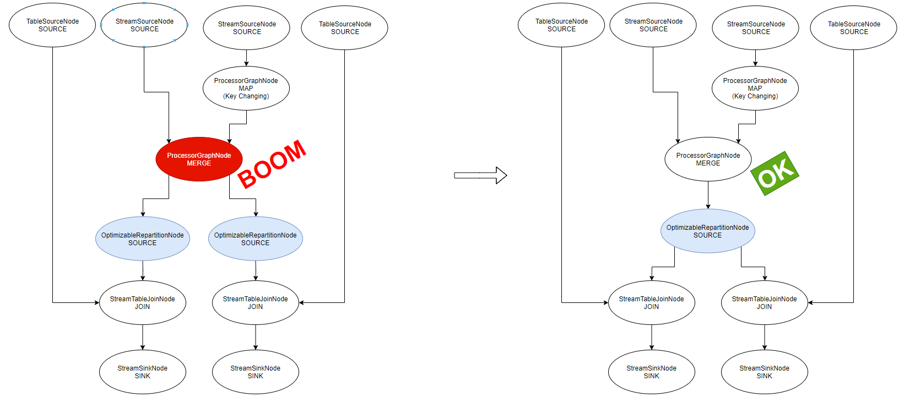

# Conclusion

I've started with my `merge()` thing and fell into the rabbit hole. It was a bit long but I hope you learned something!

Optimizations clearly reduce the load on our Kafka Cluster by avoiding to create unnecessary internal topics. This will improve speed and reduce mem/network pressure because it will need less data and unnecessary operations to process our streams.

Despite a few subtleties (value-changing after key-changing) and exceptions we can get when starting the Kafka Streams application (they won't make it into production anyway), we should build our Topology using `(StreamsConfig.TOPOLOGY_OPTIMIZATION, StreamsConfig.OPTIMIZE)` by default. By upgrading our dependency, more and more optimizations will be available without us to do anything.

We have to be careful because this can change the topology of the internal topics. Thus, a simple dependency upgrade can change which internal topic is used and maybe alter the behavior of the application if we are doing a rolling-upgrade. (Not sure of the impact and the strategy to adapt: big-bang release?).

Finally, as Kafka Streams developers, we should always check the Topology, to understand what's going on, and try to see if we can find manual optimizations in this global picture.
